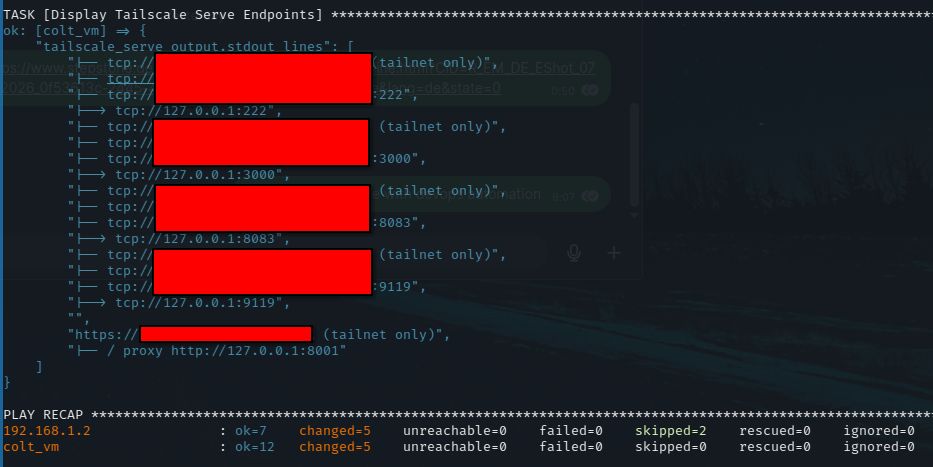

Setup steps to install the NixOs hypervisor + CoreOS vm (local machine):
-
- Plug your USB stick into your client machine
- Download the pipeline artefact
- cd ~/Downloads && 7z x artifact.zip && 7z x -p'ISO_ZIP_PASS' guardian-secure-installer.7z
- lsblk
- sudo dd if=/var/home/nix/Downloads/guardian-installer.iso of=/dev/sdb bs=4M status=progress oflag=sync
- Plug the USB stick into your local server machine and boot it
- Finally on your client machine: ANSIBLE_HOST_KEY_CHECKING=False ansible-playbook bootstrapping_and_tailscale_setup.yaml -i inventory.ini --ssh-extra-args="-o StrictHostKeyChecking=no -o UserKnownHostsFile=/dev/null"
- Important: Unplug your USB stick when the ansible playbook task "Bootstrapping hypervisor" finishes. Otherwise your machine will, depending on your boot order settings, stuck with booting into your USB stick and undo what you did
- Optionally clean the redundant files: cd ~/Downloads && sudo rm artifact.zip guardian-installer.iso guardian-secure-installer.7z

You need your tailscale authkey, inventory.ini, ansible, sshpass and colt's private key files.
With a tailscale connected client you can then connect to the docker services.

Note:
-
More VMs and native containers can be added to the hypervisor host machine.
Currently we only run a guest vm which is Fedora CoreOs that transitions into uCore.
Additionally, I also thought about using netboot.xyz instead of the manual USB stick way but that is not worth the effort for a single, local machine.

Why?
-
I tried out Proxmox (fancy, debian based wrapper for KVM and QEMU) and researched other hypervisors before. I noticed that I want something that is declarative, has native Wi-Fi support, is lightweight, very secure and stable, no config drift, and gives me total system control. That is why I decided to combine tech that I already know and handle my requirements the best. NixOs (declarative, native Wi-Fi support, and gives total control of the system through one config file) + KVM/Qemu/libvirt (kernel native and lightweight) as the combined hypervisor.
And as the guest OS I picked uCore (Fedora CoreOS) because it is designed to be a cattle. Set and forget. Instantly replaceable with a new guest instance. It is also declarative and handles docker/podman containers very well and in a very secure way. I am passing through my GPU to the AI application (docker container) inside of it.
